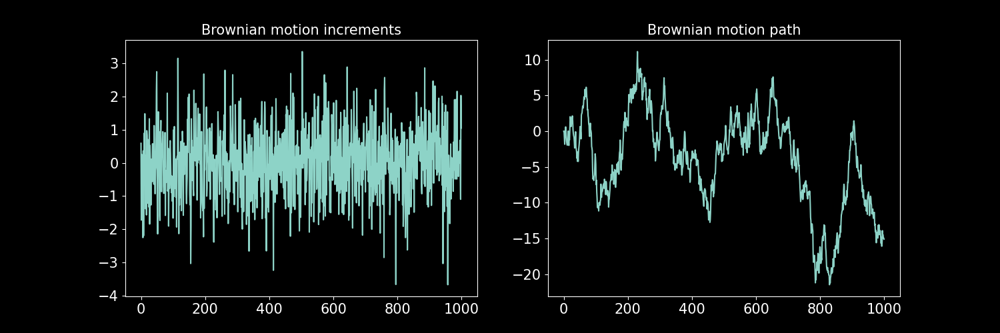
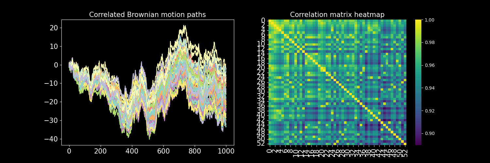

# Introduction

Status: Done

- Brownian motion is the building block of stochastic calculus and therefore, the key to simulating stochastic processes.
- **Wiener processes**, the other name given to Brownian motions, can be used to build processes with different properties and behaviors.
- In simple terms, **Brownian motion is a continuous process such that its increments for any time scale are drawn from a normal distribution.**

## ****Definition****

**Def.** A standard (one-dimensional) Wiener process (also called Brownian motion) is
a stochastic process $\{W_t\}_{t≥0+}$ indexed by nonnegative real numbers t with the following
properties:
(1) $W_0 = 0$.
(2) With probability 1, the function $t → W_t$ is continuous in $t$.
(3) The process $\{W_t\}_{t≥0}$ has stationary, independent increments.
(4) The increment $W_{t+s} - W_s$ has the $N(0, t)$ distribution.

for all $0 = t_0 < t_1 < … < t_m$ **the increments

$*W(t_1) — W(t_0), W(t_2) — W(t_1), …, W(t_m) — W(t_{m-1})*$

are independent and normally distributed. The mean of the distribution (normal) is zero and its variance is the time difference $*t_{i+1} — t_i*$.

### Generating a Brownian motion in Python

The following code generates the increments of a Wiener process ($*dW*$) discretely sampled in unit time as well as the process path ($*W*$):

```python
from typing import Optional

import numpy as np

def get_dW(T: int, random_state: Optional[int] = None) -> np.ndarray:
    """
    Sample T times from a normal distribution,
    to simulate discrete increments (dW) of a Brownian Motion.
    Optional random_state to reproduce results.
    """
    np.random.seed(random_state)
    return np.random.normal(0.0, 1.0, T)

def get_W(T: int, random_state: Optional[int] = None) -> np.ndarray:
    """
    Simulate a Brownian motion discretely samplet at unit time increments.
    Returns the cumulative sum
    """
    dW = get_dW(T, random_state)
    # cumulative sum and then make the first index 0.
    dW_cs = dW.cumsum()
    return np.insert(dW_cs, 0, 0)[:-1]
```

An example, for $*T*$ (sample size) of 1,000:

```python
dW = get_dW(T=1_000)
W = get_W(T=1_000)

#----------------------------------------------------------------
# plot

import matplotlib.pyplot as plt 
import seaborn as sns

fig = plt.figure(figsize=(15, 5))

title = "Brownian motion increments"
plt.subplot(1, 2, 1)
plt.plot(dW)
plt.gca().set_title(title, fontsize=15)
plt.xticks(fontsize=15)
plt.yticks(fontsize=15)

title = "Brownian motion path"
plt.subplot(1, 2, 2)
plt.plot(W)
plt.gca().set_title(title, fontsize=15)
plt.xticks(fontsize=15)
plt.yticks(fontsize=15)
```



## ****Correlated processes****

Brownian motion can be correlated to another Brownian motion.

Let $*W_1*$ be a Brownian motion and $*W_3*$ another Brownian motion correlated to $*W_1*$, then:

$$
dW_{3,t} = \rho dW_{1,t} + \sqrt{1-\rho^2} dW_{2,t}
$$

where $*W_2*$ is another independent Brownian motion. The correlation of $*W_3*$ and $*W_1*$ is $ρ$.

**Note:**  even though there is correlation between the two processes $*W_3*$ and $*W_1*$, there are still two sources of randomness, $*W_1*$ and $*W_2*$., i.e. , **correlation does not decrease the sources of randomness.**

The following function generates a correlated Brownian motion. Returns the increments of such correlated process.

```python
from typing import Optional

import numpy as np

def _get_correlated_dW(
    dW: np.ndarray, rho: float, random_state: Optional[int] = None
) -> np.ndarray:
    """
    Sample correlated discrete Brownian increments to given increments dW.
    """
    dW2 = get_dW(
        len(dW), random_state=random_state
    )  # generate Brownian icrements.
    if np.array_equal(dW2, dW):
        # dW cannot be equal to dW2.
        raise ValueError(
            "Brownian Increment error, try choosing different random state."
        )
    return rho * dW + np.sqrt(1 - rho ** 2) * dW2
```

However, we seldom want just a pair of correlated processes. Rather, we often require many process somehow correlated, an N-dimensional Wiener process.

The following algorithm’s idea is to first generate one Brownian motion, then, another correlated to the first one by $ρ$, the subsequent processes should be correlated by $ρ$  to a random choice of the processes already generated.

```python
from typing import Optional

import numpy as np

def get_corr_dW_matrix(
    T: int,
    n_procs: int,
    rho: Optional[float] = None,
    random_state: Optional[int] = None,
) -> np.ndarray:
    """
    2D array of n_procs discrete Brownian Motion increments dW.
    Each column of the array is one process.
    So that the resulting shape of the array is (T, n_procs).
        - T is the number of samples of each process.
        - The correlation constant rho is used to generate a new process,
            which has rho correlation to a random process already generated,
            hence rho is only an approximation to the pairwise correlation.
        - Optional random_state to reproduce results.
    """
    rng = np.random.default_rng(random_state)
    dWs: list[np.ndarray] = []
    for i in range(n_procs):
        random_state_i = _get_random_state_i(random_state, i)
        if i == 0 or rho is None:
            dW_i = get_dW(T, random_state=random_state_i)
        else:
            dW_corr_ref = _get_corr_ref_dW(dWs, i, rng)
            dW_i = _get_correlated_dW(dW_corr_ref, rho, random_state_i)
        dWs.append(dW_i)
    return np.asarray(dWs).T
    

def _get_random_state_i(random_state: Optional[int], i: int) -> Optional[int]:
    """Add i to random_state is is int, else return None."""
    return random_state if random_state is None else random_state + i

def _get_corr_ref_dW(
    dWs: list[np.ndarray], i: int, rng: np.random.Generator
) -> np.ndarray:
    """
    Choose randomly a process (dW) the from the
    already generated processes (dWs).
    """
    random_proc_idx = rng.choice(i)
    return dWs[random_proc_idx]
```

Using this code we can generate as many processes as we wish:

```python
T = 1_000
n_procs = 53
rho = 0.99

corr_dWs = get_corr_dW_matrix(T, n_procs, rho)

#----------------------------------------------------------------
# plot

import matplotlib.pyplot as plt 
import seaborn as sns

fig = plt.figure(figsize=(15, 5))

# paths
title = "Correlated Brownian motion paths"
plt.subplot(1, 2, 1)
plt.plot(np.cumsum(corr_dWs, axis=0))
plt.gca().set_title(title, fontsize=15)
plt.xticks(fontsize=15)
plt.yticks(fontsize=15)

# correlation
title = "Correlation matrix heatmap"
plt.subplot(1, 2, 2)
sns.heatmap(np.corrcoef(corr_dWs, rowvar=False), cmap="viridis")
plt.gca().set_title(title, fontsize=15)
plt.xticks(fontsize=15)
plt.yticks(fontsize=15)
```



## ****Diffusive processes****

The most general form in which we can use a Brownian motion to build more complex processes is the Itô diffusive process

$$
dX_t = a_1(X_t,t)dt + b_1(X_t,t)dW_t
$$

where $*a_1*$ and $*b_1*$ are functions of $*t$* (time) and the process itself. The first term corresponds to the deterministic part and the second term to the random part.

**Note**: the Brownian motions in such diffusive processes can be correlated, the same way as in the previous section. If the Brownian Motions ($*W_t*$) are correlated, then the Itô processes ($*X_t*$) are correlated.

# The Ornstein Uhlenbeck Process

Status: Done

## The equation of the process

The Ornstein-Uhlenbeck (OU for short) process satisfies the stochastic differential equation (SDE):

$$
dX_t = \alpha (\gamma - X_t)dt +\beta dW_t
$$

where $*W_t$* is a Brownian motion, $α$ and $β$ are positive constants. 

- When $*X_t$* is larger than $γ$ (the asymptotic mean), the drift is negative, pulling the process back to the mean, when $*X_t$* is smaller than $γ$, the opposite happens.
- $α$, the mean-reversion parameter, controls the magnitude of the drift, so higher values will cause the process to mean-revert more aggressively.
- $β$ controls the random shocks of the process. Note that for very high values of $β$, the process is, asymptotically, a rescaled Brownian motion as the drift no longer has a significant effect.

There are two main reasons why this process is used as the canonical process for stationary processes:

1. The stochastic differential equation is integrable in closed-form (and we love that).
2. The process path is normally distributed. So if Brownian motion is at the center of stochastic processes because its increments are normally distributed, then the OU process is at the center of mean-reverting processes because its path is normally distributed.

The solution to the SDE is:

$$
X_t = X_0e^{-\alpha t} + \gamma (1-e^{-\alpha t}) + \beta  e^{-\alpha t} \int_{0}^{t} e^{\alpha s} dW_s
$$

its asymptotic mean and variance are $γ$ and $β^2 / 2α$ respectively. Hence, the distribution of the process is  $N(γ, β² / 2α)$.

## ****Simulating the process****

define the parameters in a data class.

```python
from dataclasses import dataclass

@dataclass
class OUParams:
    alpha: float  # mean reversion parameter
    gamma: float  # asymptotic mean
    beta: float  # Brownian motion scale (standard deviation)
```

```python
from typing import Optional

import numpy as np

import brownian_motion

def get_OU_process(
    T: int,
    OU_params: OUParams,
    X_0: Optional[float] = None,
    random_state: Optional[int] = None,
) -> np.ndarray:
    """
    - T is the sample size.
    - Ou_params is an instance of OUParams dataclass.
    - X_0 the initial value for the process, if None, then X_0 is taken
        to be gamma (the asymptotic mean).
    Returns a 1D array.
    """
    t = np.arange(T, dtype=np.float128) # float to avoid np.exp overflow
    exp_alpha_t = np.exp(-OU_params.alpha * t)
    dW = brownian_motion.get_dW(T, random_state)
    integral_W = _get_integal_W(t, dW, OU_params)
    _X_0 = _select_X_0(X_0, OU_params)
    return (
        _X_0 * exp_alpha_t
        + OU_params.gamma * (1 - exp_alpha_t)
        + OU_params.beta * exp_alpha_t * integral_W
    )

def _select_X_0(X_0_in: Optional[float], OU_params: OUParams) -> float:
    """Returns X_0 input if not none, else gamma (the long term mean)."""
    if X_0_in is not None:
        return X_0_in
    return OU_params.gamma

def _get_integal_W(
    t: np.ndarray, dW: np.ndarray, OU_params: OUParams
) -> np.ndarray:
    """Integral with respect to Brownian Motion (W), ∫...dW."""
    exp_alpha_s = np.exp(OU_params.alpha * t)
    integral_W = np.cumsum(exp_alpha_s * dW)
    return np.insert(integral_W, 0, 0)[:-1]
```

simulate an OU process:

```python
OU_params = OUParams(alpha=0.07, gamma=0.0, beta=0.001)
OU_proc = get_OU_process(1_000, OU_params)

#----------------------------------------------------
# plot
import matplotlib.pyplot as plt

fig = plt.figure(figsize=(15, 7))

title = "Ornstein-Uhlenbeck process, "
title += r"$\alpha=0.07$, $\gamma = 0$, $\beta = 0.001$"
plt.plot(OU_proc)
plt.gca().set_title(title, fontsize=15)
plt.xticks(fontsize=15)
plt.yticks(fontsize=15)
```


## ****Estimating parameters from data****

To estimate the OU parameters from a given process we use ordinary least squares (OLS) regression.

We approximate the stochastic differential equation by a discrete equation (the time series way), known as the Euler-Maruyama method (the random difference Δ*X_t*
 is taken as a forward difference):

$$
\Delta X_t = \alpha \gamma \Delta t - \alpha X_t \Delta t + \beta \epsilon_t
$$

, if we make Δt = 1, then:

$$
\Delta X_t = \alpha \gamma - \alpha X_t + \beta \epsilon_t
$$

where $\epsilon$ is i.i.d standard normal. 

It’s easy to see the regression specification, i.e. an equation of the form $y = a + b X + \epsilon$.The following function performs the regression and estimates the OU parameters:

```python
from sklearn.linear_model import LinearRegression

def estimate_OU_params(X_t: np.ndarray) -> OUParams:
    """
    Estimate OU params from OLS regression.
    - X_t is a 1D array.
    Returns instance of OUParams.
    """
    y = np.diff(X_t)
    X = X_t[:-1].reshape(-1, 1)
    reg = LinearRegression(fit_intercept=True)
    reg.fit(X, y)
    # regression coeficient and constant
    alpha = -reg.coef_[0]
    gamma = reg.intercept_ / alpha
    # residuals and their standard deviation
    y_hat = reg.predict(X)
    beta = np.std(y - y_hat)
    return OUParams(alpha, gamma, beta)
```

test it with a simulated process to see if we can recover the OU params.

```python
# generate process with random_state to reproduce results
OU_params = OUParams(alpha=0.07, gamma=0.0, beta=0.001)
OU_proc = get_OU_process(100_000, OU_params, random_state=7)

OU_params_hat = estimate_OU_params(OU_proc)
```

We get: alpha=0.06845699877932049, gamma=-3.99059358756109e-05, beta=0.00092785693546220497295.

## ****Correlated processes****

As we saw in Introduction, Itô diffusive process random terms can be correlated.

There are two main functionalities that we may want here:

1. All processes have the same OU parameters and they are correlated.
2. Every process has different OU parameters but processes are correlated.

We achieve this by letting the “OU_params” argument in the following code take two different types. If it is an instance of “OUParams” then it’s case 1; if it is a tuple of instances of “OUParams” then it’s case 2.

```python
from typing import Optional, Union

import numpy as np

def get_corr_OU_procs(
    T: int,
    OU_params: Union[OUParams, tuple[OUParams, ...]],
    n_procs: Optional[int] = None,
    rho: Optional[float] = None,
    random_state: Optional[int] = None,
) -> np.ndarray:
    """
    Simulate correlated OU processes, correlation (rho) can be 0 or None.
    - T is the sample size of the processes.
    - OU_params can be a an instance of OUParams, in that case
        all processes have the same parameters. It can also be a tuple,
        in that case each process will have the parameters in the tuple,
        each column in the resulting 2D array corresponds to the tuple index.
    - n_procs is ignored if OU_params is tuple, else, corresponds to the number
        of processes desired. If OU_params is not tuple and n_procs is None, will
        raise ValueError.
    - rho is the correlation coefficient.
    - random_state to reproduce results.
    """
    _n_procs = _get_n_procs(OU_params, n_procs)
    corr_dWs = brownian_motion.get_corr_dW_matrix(
        T, _n_procs, rho, random_state
    )
    is_OU_params_tpl = _is_OU_params_tuple(OU_params)
    OU_procs = []
    for i in range(_n_procs):
        OU_params_i = _get_OU_params_i(OU_params, i, is_OU_params_tpl)
        dW_i = corr_dWs[:, i]
        OU_procs.append(_get_OU_process_i(T, OU_params_i, dW_i))
    return np.asarray(OU_procs).T

def _is_OU_params_tuple(
    OU_params: Union[OUParams, tuple[OUParams, ...]]
) -> bool:
    """
    Check is OU_params is a tuple of params,
    return bool.
    """
    return isinstance(OU_params, tuple)

def _get_n_procs(
    OU_params: Union[OUParams, tuple[OUParams, ...]], n_procs: Optional[int]
) -> int:
    """
    Define the number of processes, if Ou_params is a tuple the
    number of processes is the lenght of the tuple. If it is not a tuple
    then it is the "n_procs" supplied as argument,
    if it is None will raise ValueError.
    """
    if _is_OU_params_tuple(OU_params):
        return len(OU_params)  # type: ignore
    elif n_procs is None:
        raise ValueError("If OU_params is not tuple, n_procs cannot be None.")
    return n_procs

def _get_OU_params_i(
    OU_params: Union[OUParams, tuple[OUParams, ...]],
    i: int,
    is_OU_params_tpl: bool,
) -> OUParams:
    """
    Returns the ith value of the OU_params tuple if it is a tuple,
    otherwise returns OUParams.
    """
    if is_OU_params_tpl:
        return OU_params[i]  # type: ignore
    return OU_params  # type: ignore

def _get_OU_process_i(
    T: int, OU_params: OUParams, dW: np.ndarray
) -> np.ndarray:
    """
    Simulates the OU process with an external dW.
    X_0 is taken as the asymptotic mean gamma for simplicity.
    """
    t = np.arange(T, dtype=np.float128)  # float to avoid np.exp overflow
    exp_alpha_t = np.exp(-OU_params.alpha * t)
    integral_W = _get_integal_W(t, dW, OU_params)
    return (
        OU_params.gamma * exp_alpha_t
        + OU_params.gamma * (1 - exp_alpha_t)
        + OU_params.beta * exp_alpha_t * integral_W
    )
```

Examples of both cases of usage:

```python
# case 1

T = 1_000
OU_params = OUParams(alpha=0.07, gamma=0.0, beta=0.001)
n_proc = 5
rho = 0.9
OU_procs = get_corr_OU_procs(T, OU_params, n_proc, rho)

#----------------------------------------------------
# plot
import matplotlib.pyplot as plt
import seaborn as sns

fig = plt.figure(figsize=(15, 5))

title = "Correlated Ornstein-Uhlenbeck processes, single params"
plt.subplot(1, 2, 1)
plt.plot(OU_procs)
plt.gca().set_title(title, fontsize=15)
plt.xticks(fontsize=15)
plt.yticks(fontsize=15)

title = "Correlation matrix (increments) heatmap"
plt.subplot(1, 2, 2)
sns.heatmap(np.corrcoef(np.diff(OU_procs, axis=0), rowvar=False), cmap="mako")
plt.gca().set_title(title, fontsize=15)
plt.xticks(fontsize=15)
plt.yticks(fontsize=15)
```


```python
# case 2

T = 1_000
OU_params = (
    OUParams(alpha=0.07, gamma=0.0, beta=0.005),
    OUParams(alpha=0.05, gamma=0.0, beta=0.003),
    OUParams(alpha=0.06, gamma=0.0, beta=0.002),
    OUParams(alpha=0.09, gamma=0.0, beta=0.002),
    OUParams(alpha=0.08, gamma=0.0, beta=0.001),
)
rho = 0.9
OU_procs = get_corr_OU_procs(T, OU_params, n_proc, rho)

#----------------------------------------------------
# plot
import matplotlib.pyplot as plt
import seaborn as sns

fig = plt.figure(figsize=(15, 5))

title = "Correlated Ornstein-Uhlenbeck processes, multi params"
plt.subplot(1, 2, 1)
plt.plot(OU_procs)
plt.gca().set_title(title, fontsize=15)
plt.xticks(fontsize=15)
plt.yticks(fontsize=15)

title = "Correlation matrix (increments) heatmap"
plt.subplot(1, 2, 2)
sns.heatmap(np.corrcoef(np.diff(OU_procs, axis=0), rowvar=False), cmap="mako")
plt.gca().set_title(title, fontsize=15)
plt.xticks(fontsize=15)
plt.yticks(fontsize=15)
```


