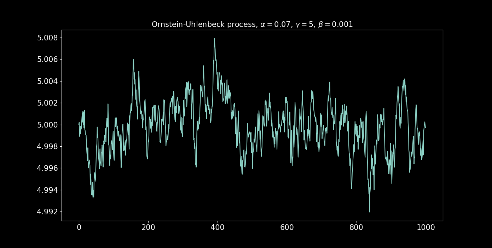

For a better version, please view the link on Notion, where I initially did on. Thanks!!!

https://held-handspring-a63.notion.site/Brownian-Motion-4aad705ef7374057bae83cd882e9ee52?pvs=4

# Introduction

- Brownian motion is the building block of stochastic calculus and therefore, the key to simulating stochastic processes.
- **Wiener processes**, the other name given to Brownian motions, can be used to build processes with different properties and behaviors.
- In simple terms, **Brownian motion is a continuous process such that its increments for any time scale are drawn from a normal distribution.**

## ****Definition****

**Def.** A standard (one-dimensional) Wiener process (also called Brownian motion) is
a stochastic process $\{W_t\}_{t≥0+}$ indexed by nonnegative real numbers t with the following
properties:
(1) $W_0 = 0$.
(2) With probability 1, the function $t → W_t$ is continuous in $t$.
(3) The process $\{W_t\}_{t≥0}$ has stationary, independent increments.
(4) The increment $W_{t+s} - W_s$ has the $N(0, t)$ distribution.

for all $0 = t_0 < t_1 < … < t_m$ **the increments

$*W(t_1) — W(t_0), W(t_2) — W(t_1), …, W(t_m) — W(t_{m-1})*$

are independent and normally distributed. The mean of the distribution (normal) is zero and its variance is the time difference $*t_{i+1} — t_i*$.

### Generating a Brownian motion in Python

The following code generates the increments of a Wiener process ($*dW*$) discretely sampled in unit time as well as the process path ($*W*$):

```python
from typing import Optional

import numpy as np

def get_dW(T: int, random_state: Optional[int] = None) -> np.ndarray:
    """
    Sample T times from a normal distribution,
    to simulate discrete increments (dW) of a Brownian Motion.
    Optional random_state to reproduce results.
    """
    np.random.seed(random_state)
    return np.random.normal(0.0, 1.0, T)

def get_W(T: int, random_state: Optional[int] = None) -> np.ndarray:
    """
    Simulate a Brownian motion discretely samplet at unit time increments.
    Returns the cumulative sum
    """
    dW = get_dW(T, random_state)
    # cumulative sum and then make the first index 0.
    dW_cs = dW.cumsum()
    return np.insert(dW_cs, 0, 0)[:-1]
```

An example, for $*T*$ (sample size) of 1,000:

```python
dW = get_dW(T=1_000)
W = get_W(T=1_000)

#----------------------------------------------------------------
# plot

import matplotlib.pyplot as plt 
import seaborn as sns

fig = plt.figure(figsize=(15, 5))

title = "Brownian motion increments"
plt.subplot(1, 2, 1)
plt.plot(dW)
plt.gca().set_title(title, fontsize=15)
plt.xticks(fontsize=15)
plt.yticks(fontsize=15)

title = "Brownian motion path"
plt.subplot(1, 2, 2)
plt.plot(W)
plt.gca().set_title(title, fontsize=15)
plt.xticks(fontsize=15)
plt.yticks(fontsize=15)
```



## ****Correlated processes****

Brownian motion can be correlated to another Brownian motion.

Let $*W_1*$ be a Brownian motion and $*W_3*$ another Brownian motion correlated to $*W_1*$, then:

$$
dW_{3,t} = \rho dW_{1,t} + \sqrt{1-\rho^2} dW_{2,t}
$$

where $*W_2*$ is another independent Brownian motion. The correlation of $*W_3*$ and $*W_1*$ is $ρ$.

**Note:**  even though there is correlation between the two processes $*W_3*$ and $*W_1*$, there are still two sources of randomness, $*W_1*$ and $*W_2*$., i.e. , **correlation does not decrease the sources of randomness.**

The following function generates a correlated Brownian motion. Returns the increments of such correlated process.

```python
from typing import Optional

import numpy as np

def _get_correlated_dW(
    dW: np.ndarray, rho: float, random_state: Optional[int] = None
) -> np.ndarray:
    """
    Sample correlated discrete Brownian increments to given increments dW.
    """
    dW2 = get_dW(
        len(dW), random_state=random_state
    )  # generate Brownian icrements.
    if np.array_equal(dW2, dW):
        # dW cannot be equal to dW2.
        raise ValueError(
            "Brownian Increment error, try choosing different random state."
        )
    return rho * dW + np.sqrt(1 - rho ** 2) * dW2
```

However, we seldom want just a pair of correlated processes. Rather, we often require many process somehow correlated, an N-dimensional Wiener process.

The following algorithm’s idea is to first generate one Brownian motion, then, another correlated to the first one by $ρ$, the subsequent processes should be correlated by $ρ$  to a random choice of the processes already generated.

```python
from typing import Optional

import numpy as np

def get_corr_dW_matrix(
    T: int,
    n_procs: int,
    rho: Optional[float] = None,
    random_state: Optional[int] = None,
) -> np.ndarray:
    """
    2D array of n_procs discrete Brownian Motion increments dW.
    Each column of the array is one process.
    So that the resulting shape of the array is (T, n_procs).
        - T is the number of samples of each process.
        - The correlation constant rho is used to generate a new process,
            which has rho correlation to a random process already generated,
            hence rho is only an approximation to the pairwise correlation.
        - Optional random_state to reproduce results.
    """
    rng = np.random.default_rng(random_state)
    dWs: list[np.ndarray] = []
    for i in range(n_procs):
        random_state_i = _get_random_state_i(random_state, i)
        if i == 0 or rho is None:
            dW_i = get_dW(T, random_state=random_state_i)
        else:
            dW_corr_ref = _get_corr_ref_dW(dWs, i, rng)
            dW_i = _get_correlated_dW(dW_corr_ref, rho, random_state_i)
        dWs.append(dW_i)
    return np.asarray(dWs).T
    

def _get_random_state_i(random_state: Optional[int], i: int) -> Optional[int]:
    """Add i to random_state is is int, else return None."""
    return random_state if random_state is None else random_state + i

def _get_corr_ref_dW(
    dWs: list[np.ndarray], i: int, rng: np.random.Generator
) -> np.ndarray:
    """
    Choose randomly a process (dW) the from the
    already generated processes (dWs).
    """
    random_proc_idx = rng.choice(i)
    return dWs[random_proc_idx]
```

Using this code we can generate as many processes as we wish:

```python
T = 1_000
n_procs = 53
rho = 0.99

corr_dWs = get_corr_dW_matrix(T, n_procs, rho)

#----------------------------------------------------------------
# plot

import matplotlib.pyplot as plt 
import seaborn as sns

fig = plt.figure(figsize=(15, 5))

# paths
title = "Correlated Brownian motion paths"
plt.subplot(1, 2, 1)
plt.plot(np.cumsum(corr_dWs, axis=0))
plt.gca().set_title(title, fontsize=15)
plt.xticks(fontsize=15)
plt.yticks(fontsize=15)

# correlation
title = "Correlation matrix heatmap"
plt.subplot(1, 2, 2)
sns.heatmap(np.corrcoef(corr_dWs, rowvar=False), cmap="viridis")
plt.gca().set_title(title, fontsize=15)
plt.xticks(fontsize=15)
plt.yticks(fontsize=15)
```


## ****Diffusive processes****

The most general form in which we can use a Brownian motion to build more complex processes is the Itô diffusive process

$$
dX_t = a_1(X_t,t)dt + b_1(X_t,t)dW_t
$$

where $*a_1*$ and $*b_1*$ are functions of $*t$* (time) and the process itself. The first term corresponds to the deterministic part and the second term to the random part.

**Note**: the Brownian motions in such diffusive processes can be correlated, the same way as in the previous section. If the Brownian Motions ($*W_t*$) are correlated, then the Itô processes ($*X_t*$) are correlated.

# The Ornstein Uhlenbeck Process

Status: Done

## The equation of the process

The Ornstein-Uhlenbeck (OU for short) process satisfies the stochastic differential equation (SDE):

$$
dX_t = \alpha (\gamma - X_t)dt +\beta dW_t
$$

where $*W_t$* is a Brownian motion, $α$ and $β$ are positive constants. 

- When $*X_t$* is larger than $γ$ (the asymptotic mean), the drift is negative, pulling the process back to the mean, when $*X_t$* is smaller than $γ$, the opposite happens.
- $α$, the mean-reversion parameter, controls the magnitude of the drift, so higher values will cause the process to mean-revert more aggressively.
- $β$ controls the random shocks of the process. Note that for very high values of $β$, the process is, asymptotically, a rescaled Brownian motion as the drift no longer has a significant effect.

There are two main reasons why this process is used as the canonical process for stationary processes:

1. The stochastic differential equation is integrable in closed-form (and we love that).
2. The process path is normally distributed. So if Brownian motion is at the center of stochastic processes because its increments are normally distributed, then the OU process is at the center of mean-reverting processes because its path is normally distributed.

The solution to the SDE is:

$$
X_t = X_0e^{-\alpha t} + \gamma (1-e^{-\alpha t}) + \beta  e^{-\alpha t} \int_{0}^{t} e^{\alpha s} dW_s
$$

its asymptotic mean and variance are $γ$ and $β^2 / 2α$ respectively. Hence, the distribution of the process is  $N(γ, β² / 2α)$.

## ****Simulating the process****

define the parameters in a data class.

```python
from dataclasses import dataclass

@dataclass
class OUParams:
    alpha: float  # mean reversion parameter
    gamma: float  # asymptotic mean
    beta: float  # Brownian motion scale (standard deviation)
```

```python
from typing import Optional

import numpy as np

import brownian_motion

def get_OU_process(
    T: int,
    OU_params: OUParams,
    X_0: Optional[float] = None,
    random_state: Optional[int] = None,
) -> np.ndarray:
    """
    - T is the sample size.
    - Ou_params is an instance of OUParams dataclass.
    - X_0 the initial value for the process, if None, then X_0 is taken
        to be gamma (the asymptotic mean).
    Returns a 1D array.
    """
    t = np.arange(T, dtype=np.float128) # float to avoid np.exp overflow
    exp_alpha_t = np.exp(-OU_params.alpha * t)
    dW = brownian_motion.get_dW(T, random_state)
    integral_W = _get_integal_W(t, dW, OU_params)
    _X_0 = _select_X_0(X_0, OU_params)
    return (
        _X_0 * exp_alpha_t
        + OU_params.gamma * (1 - exp_alpha_t)
        + OU_params.beta * exp_alpha_t * integral_W
    )

def _select_X_0(X_0_in: Optional[float], OU_params: OUParams) -> float:
    """Returns X_0 input if not none, else gamma (the long term mean)."""
    if X_0_in is not None:
        return X_0_in
    return OU_params.gamma

def _get_integal_W(
    t: np.ndarray, dW: np.ndarray, OU_params: OUParams
) -> np.ndarray:
    """Integral with respect to Brownian Motion (W), ∫...dW."""
    exp_alpha_s = np.exp(OU_params.alpha * t)
    integral_W = np.cumsum(exp_alpha_s * dW)
    return np.insert(integral_W, 0, 0)[:-1]
```

simulate an OU process:

```python
OU_params = OUParams(alpha=0.07, gamma=0.0, beta=0.001)
OU_proc = get_OU_process(1_000, OU_params)

#----------------------------------------------------
# plot
import matplotlib.pyplot as plt

fig = plt.figure(figsize=(15, 7))

title = "Ornstein-Uhlenbeck process, "
title += r"$\alpha=0.07$, $\gamma = 0$, $\beta = 0.001$"
plt.plot(OU_proc)
plt.gca().set_title(title, fontsize=15)
plt.xticks(fontsize=15)
plt.yticks(fontsize=15)
```


## ****Estimating parameters from data****

To estimate the OU parameters from a given process we use ordinary least squares (OLS) regression.

We approximate the stochastic differential equation by a discrete equation (the time series way), known as the Euler-Maruyama method (the random difference Δ*X_t*
 is taken as a forward difference):

$$
\Delta X_t = \alpha \gamma \Delta t - \alpha X_t \Delta t + \beta \epsilon_t
$$

, if we make Δt = 1, then:

$$
\Delta X_t = \alpha \gamma - \alpha X_t + \beta \epsilon_t
$$

where $\epsilon$ is i.i.d standard normal. 

It’s easy to see the regression specification, i.e. an equation of the form $y = a + b X + \epsilon$.The following function performs the regression and estimates the OU parameters:

```python
from sklearn.linear_model import LinearRegression

def estimate_OU_params(X_t: np.ndarray) -> OUParams:
    """
    Estimate OU params from OLS regression.
    - X_t is a 1D array.
    Returns instance of OUParams.
    """
    y = np.diff(X_t)
    X = X_t[:-1].reshape(-1, 1)
    reg = LinearRegression(fit_intercept=True)
    reg.fit(X, y)
    # regression coeficient and constant
    alpha = -reg.coef_[0]
    gamma = reg.intercept_ / alpha
    # residuals and their standard deviation
    y_hat = reg.predict(X)
    beta = np.std(y - y_hat)
    return OUParams(alpha, gamma, beta)
```

test it with a simulated process to see if we can recover the OU params.

```python
# generate process with random_state to reproduce results
OU_params = OUParams(alpha=0.07, gamma=0.0, beta=0.001)
OU_proc = get_OU_process(100_000, OU_params, random_state=7)

OU_params_hat = estimate_OU_params(OU_proc)
```

We get: alpha=0.06845699877932049, gamma=-3.99059358756109e-05, beta=0.00092785693546220497295.

## ****Correlated processes****

As we saw in Introduction, Itô diffusive process random terms can be correlated.

There are two main functionalities that we may want here:

1. All processes have the same OU parameters and they are correlated.
2. Every process has different OU parameters but processes are correlated.

We achieve this by letting the “OU_params” argument in the following code take two different types. If it is an instance of “OUParams” then it’s case 1; if it is a tuple of instances of “OUParams” then it’s case 2.

```python
from typing import Optional, Union

import numpy as np

def get_corr_OU_procs(
    T: int,
    OU_params: Union[OUParams, tuple[OUParams, ...]],
    n_procs: Optional[int] = None,
    rho: Optional[float] = None,
    random_state: Optional[int] = None,
) -> np.ndarray:
    """
    Simulate correlated OU processes, correlation (rho) can be 0 or None.
    - T is the sample size of the processes.
    - OU_params can be a an instance of OUParams, in that case
        all processes have the same parameters. It can also be a tuple,
        in that case each process will have the parameters in the tuple,
        each column in the resulting 2D array corresponds to the tuple index.
    - n_procs is ignored if OU_params is tuple, else, corresponds to the number
        of processes desired. If OU_params is not tuple and n_procs is None, will
        raise ValueError.
    - rho is the correlation coefficient.
    - random_state to reproduce results.
    """
    _n_procs = _get_n_procs(OU_params, n_procs)
    corr_dWs = brownian_motion.get_corr_dW_matrix(
        T, _n_procs, rho, random_state
    )
    is_OU_params_tpl = _is_OU_params_tuple(OU_params)
    OU_procs = []
    for i in range(_n_procs):
        OU_params_i = _get_OU_params_i(OU_params, i, is_OU_params_tpl)
        dW_i = corr_dWs[:, i]
        OU_procs.append(_get_OU_process_i(T, OU_params_i, dW_i))
    return np.asarray(OU_procs).T

def _is_OU_params_tuple(
    OU_params: Union[OUParams, tuple[OUParams, ...]]
) -> bool:
    """
    Check is OU_params is a tuple of params,
    return bool.
    """
    return isinstance(OU_params, tuple)

def _get_n_procs(
    OU_params: Union[OUParams, tuple[OUParams, ...]], n_procs: Optional[int]
) -> int:
    """
    Define the number of processes, if Ou_params is a tuple the
    number of processes is the lenght of the tuple. If it is not a tuple
    then it is the "n_procs" supplied as argument,
    if it is None will raise ValueError.
    """
    if _is_OU_params_tuple(OU_params):
        return len(OU_params)  # type: ignore
    elif n_procs is None:
        raise ValueError("If OU_params is not tuple, n_procs cannot be None.")
    return n_procs

def _get_OU_params_i(
    OU_params: Union[OUParams, tuple[OUParams, ...]],
    i: int,
    is_OU_params_tpl: bool,
) -> OUParams:
    """
    Returns the ith value of the OU_params tuple if it is a tuple,
    otherwise returns OUParams.
    """
    if is_OU_params_tpl:
        return OU_params[i]  # type: ignore
    return OU_params  # type: ignore

def _get_OU_process_i(
    T: int, OU_params: OUParams, dW: np.ndarray
) -> np.ndarray:
    """
    Simulates the OU process with an external dW.
    X_0 is taken as the asymptotic mean gamma for simplicity.
    """
    t = np.arange(T, dtype=np.float128)  # float to avoid np.exp overflow
    exp_alpha_t = np.exp(-OU_params.alpha * t)
    integral_W = _get_integal_W(t, dW, OU_params)
    return (
        OU_params.gamma * exp_alpha_t
        + OU_params.gamma * (1 - exp_alpha_t)
        + OU_params.beta * exp_alpha_t * integral_W
    )
```

Examples of both cases of usage:

```python
# case 1

T = 1_000
OU_params = OUParams(alpha=0.07, gamma=0.0, beta=0.001)
n_proc = 5
rho = 0.9
OU_procs = get_corr_OU_procs(T, OU_params, n_proc, rho)

#----------------------------------------------------
# plot
import matplotlib.pyplot as plt
import seaborn as sns

fig = plt.figure(figsize=(15, 5))

title = "Correlated Ornstein-Uhlenbeck processes, single params"
plt.subplot(1, 2, 1)
plt.plot(OU_procs)
plt.gca().set_title(title, fontsize=15)
plt.xticks(fontsize=15)
plt.yticks(fontsize=15)

title = "Correlation matrix (increments) heatmap"
plt.subplot(1, 2, 2)
sns.heatmap(np.corrcoef(np.diff(OU_procs, axis=0), rowvar=False), cmap="mako")
plt.gca().set_title(title, fontsize=15)
plt.xticks(fontsize=15)
plt.yticks(fontsize=15)
```


```python
# case 2

T = 1_000
OU_params = (
    OUParams(alpha=0.07, gamma=0.0, beta=0.005),
    OUParams(alpha=0.05, gamma=0.0, beta=0.003),
    OUParams(alpha=0.06, gamma=0.0, beta=0.002),
    OUParams(alpha=0.09, gamma=0.0, beta=0.002),
    OUParams(alpha=0.08, gamma=0.0, beta=0.001),
)
rho = 0.9
OU_procs = get_corr_OU_procs(T, OU_params, n_proc, rho)

#----------------------------------------------------
# plot
import matplotlib.pyplot as plt
import seaborn as sns

fig = plt.figure(figsize=(15, 5))

title = "Correlated Ornstein-Uhlenbeck processes, multi params"
plt.subplot(1, 2, 1)
plt.plot(OU_procs)
plt.gca().set_title(title, fontsize=15)
plt.xticks(fontsize=15)
plt.yticks(fontsize=15)

title = "Correlation matrix (increments) heatmap"
plt.subplot(1, 2, 2)
sns.heatmap(np.corrcoef(np.diff(OU_procs, axis=0), rowvar=False), cmap="mako")
plt.gca().set_title(title, fontsize=15)
plt.xticks(fontsize=15)
plt.yticks(fontsize=15)
```


# The Cox-Ingersoll-Ross Process

Status: Done

## ****SDE for the process****

The SDE (stochastic differential equation) for the CIR process is:

$$
d\sigma_t = a(b - \sigma_t)dt + c \sqrt{\sigma_t}dW_t 
$$

where $*W_t*$ is a Brownian motion, $*a*$, $*b*$ and $*c*$ are positive constants; furthermore, **to avoid zero values, the condition $*2ab \geq c^2*$ has to be met**. Note that **the process $σ_t$ cannot attain negative values**.

- Sadly, there is no closed-form solution for this SDE, but we can solve it numerically.
- The CIR process is stationary, and it has a positively skewed distribution, with an asymptotic mean $*b$.*
- The mean-reversion of the process is given by the drift term ($*dt*$ term), which has the same form as the drift term of the Ornstein-Uhlenbeck process.
- When $σ_t$ is larger than $*b$,* the drift term becomes negative, pulling **$σ_t$ back towards $*b*$. If $σ_t$ is smaller than $*b*$, the opposite happens. $***a*$ is the mean-reversion parameter,** it ****controls the magnitude of the drift, and hence, higher values will cause a more aggressive mean-reversion.
- $*c*$ controls the magnitude of the random shocks of the process ($*dW*$ term). Notice that the squared value of the process itself modulates the random shocks. Therefore, for higher process values, the random shocks are more significant than for smaller values.

## ****Simulating the process****

```python
from dataclasses import dataclass
from typing import Optional, NoReturn

@dataclass
class CIRParams:
    """CIR process params, 2ab has to be larger or equal then c^2."""

    a: float  # mean reversion parameter
    b: float  # asymptotic mean
    c: float  # Brownian motion scale factor (standard deviation)

    def __post_init__(self) -> Optional[NoReturn]:
        if 2 * self.a * self.b < self.c ** 2:
            raise ValueError("2ab has to be less than or equal to c^2.")
        return None
```

To simulate the process, we need to convert the SDE into a discrete equation (the time series way) using the Euler-Maruyama method. Making $Δt = 1$ (unit time step):

$$
\sigma_t = \sigma_{t-1} + a(b - \sigma_{t-1}) + c\sqrt{\sigma_{t-1}}\Delta W_t
$$

```python
from typing import Optional, NoReturn, Any

import numpy as np

import brownian_motion

def get_CIR_process(
    T: int,
    CIR_params: CIRParams,
    sigma_0: Optional[float] = None,
    random_state: Optional[int] = None,
) -> np.ndarray:
    """
    - T is the sample size.
    - CIR_params is an instance of CIRParams dataclass.
    - sigma_0 the initial value for the process, if None, then sigma_0 is taken
        to be b (the asymptotic mean).
    Returns a 1D array.
    """
    dW = brownian_motion.get_dW(T, random_state)
    return _generate_CIR_process(dW, CIR_params, sigma_0)

def _generate_CIR_process(
    dW: np.ndarray,
    CIR_params: CIRParams,
    sigma_0: Optional[float] = None,
) -> np.ndarray:
    """
    Generate the CIR process given the Brownian motion.
    - dW is a 1D array with the Brownian motion increments.
    - CIR_params is an instance of CIRParams dataclass.
    - sigma_0 the initial value for the process, if None, then sigma_0 is taken
        to be b (the asymptotic mean).
    Returns a 1D array.
    """
    T = len(dW)
    _sigma_0 = _select_sigma_0(sigma_0, CIR_params)
    sigma_t = [_sigma_0]
    for t in range(1, T):
        dsigma_t = (
            CIR_params.a * (CIR_params.b - sigma_t[t - 1])
            + CIR_params.c * np.sqrt(sigma_t[t - 1]) * dW[t]
        )
        # if Nan in simulation raise an error.
        _validate_not_nan(dsigma_t)
        sigma_t.append(sigma_t[t - 1] + dsigma_t)
    return np.asarray(sigma_t)

def _select_sigma_0(
    sigma_0_in: Optional[float], CIR_params: CIRParams
) -> float:
    """Returns sigma_0input if not None, else b (the long term mean)."""
    if sigma_0_in is not None:
        return sigma_0_in
    return CIR_params.b

def _validate_not_nan(dsigma_t: Any) -> Optional[NoReturn]:
    if np.isnan(dsigma_t):
        raise ValueError(
            "CIR process simulation crashed, check your CIR_params. "
            + "Maybe choose a smaller c value."
        )
    return None
```

Simulating the process:

```python
CIR_params = CIRParams(a=0.06, b=0.01, c=0.009)
CIR_proc = get_CIR_process(1_000, CIR_params)

#----------------------------------------------------
# plot
import matplotlib.pyplot as plt

fig = plt.figure(figsize=(15, 7))

title = "Cox-Ingersoll-Ross (CIR) process example"
plt.plot(CIR_proc)
plt.gca().set_title(title, fontsize=15)
plt.xticks(fontsize=15)
plt.yticks(fontsize=15)

plt.show()
```


## ****Parameter estimation****

Using the Euler-Maruyama method (the random difference $Δσ_t$ is taken as a forward difference, we approximate the stochastic differential equation by a discrete equation:

$$
\Delta \sigma_t = a(b - \sigma_t) \Delta t + c \sqrt{\sigma_t}\epsilon_t
$$

Making $Δt = 1$ and dividing by the square root of $σ_t$*:*

$$
\frac{\Delta \sigma_t}{\sqrt{\sigma_t}} = \frac{ab}{\sqrt{\sigma_t}} - a \sqrt{\sigma_t} + c \epsilon_t
$$

where $\epsilon$ is i.i.d standard normal.

Using the variable substitution:

$$
y \equiv \frac{\Delta \sigma_t}{\sqrt{\sigma_t}} \\x_1 \equiv \frac{1}{\sqrt{\sigma_t}}  \\x_2 \equiv \sqrt{\sigma_t}
$$

we can then write our discrete equation as:

$$
y = \tilde{a} x_1 +\tilde{b} x_2 + c \epsilon_t
$$

```python
import numpy as np
from sklearn.linear_model import LinearRegression

def estimate_CIR_params(sigma_t: np.ndarray) -> CIRParams:
    """
    Estimate CIR params from OLS regression.
    - sigma_t is 1D array.
    Returns instance of CIRParams.
    """
    # define regression specification
    sigma_sqrt = np.sqrt(sigma_t[:-1])
    y = np.diff(sigma_t) / sigma_sqrt
    x1 = 1.0 / sigma_sqrt
    x2 = sigma_sqrt
    X = np.concatenate([x1.reshape(-1, 1), x2.reshape(-1, 1)], axis=1)
    # regression model
    reg = LinearRegression(fit_intercept=False)
    reg.fit(X, y)
    # regression coefficients
    ab = reg.coef_[0]
    a = -reg.coef_[1]
    b = ab / a
    # residuals and their standard deviation
    y_hat = reg.predict(X)
    c = np.std(y - y_hat)
    return CIRParams(a, b, c)
```

simulated process to see if we can recover the CIR params:

```python
# generate process with random_state to reproduce results
CIR_params = CIRParams(a=0.05, b=0.5, c=0.02)
CIR_proc = get_CIR_process(1_000, CIR_params, random_state=3)

# estimate parameters
CIR_params_hat = estimate_CIR_params(CIR_proc)
```

We get: 

CIRParams(a=0.0512532478201952, b=0.5043588622427937, c=0.02014670637207867)

# Geometric Brownian Motion

Status: Done

Geometric Brownian motion is used to model stock prices in the Black–Scholes model and is the most widely used model of stock price behavior.

Some of the arguments for using GBM to model stock prices are:

- The expected returns of GBM are independent of the value of the process (stock price), which agrees with what we would expect in reality.
- A GBM process only assumes positive values, just like real stock prices.
- A GBM process shows the same kind of 'roughness' in its paths as we see in real stock prices.
- Calculations with GBM processes are relatively easy.

## ****The equation for the process****

The SDE (stochastic differential equation) for the process is:

$$
\frac{d P_t}{P_t} = \mu dt + \sigma d W_t
$$

where $*W_t*$ is a Brownian motion. In other words, the quotient of the differential and the process itself follows a diffusive process (Itô process).

Using elementary stochastic calculus we can easily integrate the SDE in closed-form

$$
P_t = P_0 \exp(\int^t_0[\mu - \frac{1}{2}\sigma^2]ds + \int^t_0 \sigma dW_s)
$$

This equation considers the possibility that $**μ$ and $σ$ are functions of $*t*$ and $*W$**,* this is why this equation is known as **generalized geometric Brownian motion**.

**When $μ$ and $σ$  are constant** then the equation is much simpler:

$$
P_t = P_0 \exp([\mu - \frac{1}{2}\sigma^2]t + \int^t_0 \sigma W_t)
$$

This is the famous **geometric Brownian Motion**.

## ****Code structure****

**Constant processes**

```python
from typing import Optional, Union

import numpy as np

class ConstantProcs:
    """
    Constant drift  matrix, each column of the matrix is a 1D process.
    - T is the sample size (rows of the matrix)
    - constants is either the constant for all processes (non random)
        or a tuple of constants one for each process
    - n_procs is the number of process (columns in the matix),
        if constants is tuple, this argument is ignored,
        if constants is a float then n_procs cannot be None,
        otherwise will raise ValueError
    The returned matrix columns are indexes in the same order as
    the constants tuple (in case it is a tuple).
    """

    def __init__(
        self,
        T: int,
        constants: Union[float, tuple[float, ...]],
        n_procs: Optional[int] = None,
    ) -> None:
        self.T = T
        self.constants = constants
        self._n_procs = n_procs

        self._n_procs_ = self._get_n_procs()

    @property
    def n_procs(self) -> int:
        """The number of drift processes."""
        return self._n_procs_

    def get_proc(self, random_state: Optional[int] = None) -> np.ndarray:
        """
        Returns a 2D array, each column is a 1D process,
        the number of rows define the sample size,
        random_state not None to reproduce results.
        """
        if isinstance(self.constants, tuple):
            return (
                np.repeat(self.constants, self.T, axis=0).reshape(-1, self.T).T
            )
        return self.constants * np.ones((self.T, self._n_procs_))

    def _get_n_procs(self) -> int:
        """
        Check what is the correct n_proc, depending on params type and
        n_procs type.
        - if constants is float then n_procs cannot be None,
            the value of n_procs is then passed as the correct one.
        - if constants is tuple n_procs input argument is
            ignored and the correct n_procs is then the size of the tuple.
        """
        if isinstance(self.constants, tuple):
            return len(self.constants)
        elif self._n_procs is None:
            raise ValueError(
                "If constants is not tuple, n_procs cannot be None."
            )
        return self._n_procs
```

****Drift process****

```python
from typing import Protocol, Optional

class Drift(Protocol):
    """
    Base class for drift processes matrix.
    Each column of the drift matrix is a 1D process.
    """

    @property
    def sample_size(self) -> int:
        """The sample size T of the drift processes."""

    @property
    def n_procs(self) -> int:
        """The number of drift processes."""

    def get_mu(self, random_state: Optional[int] = None) -> np.ndarray:
        """
        Returns a 2D array, each column is a 1D process,
        the number of rows define the sample size.,
        random_state not None to reproduce results.
        """

class ConstantDrift(ConstantProcs):
    """
    Implements the Drift Protocol.
    Constant drift processes matrix, each column of the drift
    matrix is a 1D process.
    - T is the sample size (rows of the matrix)
    - mu_constants is either the constant for all processes (non random)
        or a tuple of constants one for each process
    - n_procs is the number of process (columns in the matix),
        if mu_constants is tuple, this argument is ignored,
        if mu_constants is a float then n_procs cannot be None,
        otherwise will raise ValueError
    The returned matrix columns are indexes in the same order as
    the mu_constants tuple (in case it is a tuple).
    """

    def __init__(
        self,
        T: int,
        mu_constants: Union[float, tuple[float, ...]],
        n_procs: Optional[int] = None,
    ) -> None:
        super().__init__(T, mu_constants, n_procs)
        self.mu_constants = mu_constants
        self.T = T
        self._n_procs = n_procs

    @property
    def sample_size(self) -> int:
        """The sample size T of the drift processes."""
        return self.T

    @property
    def n_procs(self) -> int:
        """The number of drift processes."""
        return super().n_procs

    def get_mu(self, random_state: Optional[int] = None) -> np.ndarray:
        """
        Returns a 2D array, each column is a 1D process,
        the number of rows define the sample size,
        random_state not None to reproduce results.
        """
        return super().get_proc(random_state)
```

****Sigma process****

```python
from typing import Protocol, Optional

class Sigma(Protocol):
    """
    Base class for sigma processes matrix.
    Each column of the sigma matrix is a 1D process.
    """

    @property
    def sample_size(self) -> int:
        """The sample size T of the sigma processes."""

    @property
    def n_procs(self) -> int:
        """The number of sigma processes."""

    def get_sigma(self, random_state: Optional[int] = None) -> np.ndarray:
        """
        Returns a 2D array, each column is a 1D process,
        the number of rows define the sample size.,
        random_state not None to reproduce results.
        """

class ConstantSigma(ConstantProcs):
    """
    Implements the Sigma Protocol.
    Constant sigma processes matrix, each column of the drift
    matrix is a 1D process.
    - T is the sample size (rows of the matrix)
    - sigma_constants is either the constant for all processes
        (non random) or a tuple of constants one for each process
    - n_procs is the number of process (columns in the matix),
        if sigma_constants is tuple, this argument is ignored,
        if sigma_constants is a float then n_procs cannot be None,
        otherwise will raise ValueError
    The returned matrix columns are indexes in the same order as
    the mu_constants tuple (in case it is a tuple).
    """

    def __init__(
        self,
        T: int,
        sigma_constants: Union[float, tuple[float, ...]],
        n_procs: Optional[int] = None,
    ) -> None:
        super().__init__(T, sigma_constants, n_procs)
        self.sigma_constants = sigma_constants
        self.T = T
        self._n_procs = n_procs

    @property
    def sample_size(self) -> int:
        """The sample size T of the sigma processes."""
        return self.T

    @property
    def n_procs(self) -> int:
        """The number of sigma processes."""
        return super().n_procs

    def get_sigma(self, random_state: Optional[int] = None) -> np.ndarray:
        """
        Returns a 2D array, each column is a 1D process,
        the number of rows define the sample size,
        random_state not None to reproduce results.
        """
        return super().get_proc(random_state)
```

****Initial values****

Initial values are the values for $*P_0*$

```python
from typing import Protocol, Optional

class InitP(Protocol):
    """
    Base for the vector of initial values for gen geometic
    Brownian motions (P_0).
    """

    @property
    def n_procs(self) -> int:
        """The number of init Ps (P_0's), length of P_0s vector."""

    def get_P_0(self, random_state: Optional[int] = None) -> np.ndarray:
        """
        Returns a 1D vector, random_state to reproduce
        results in case ther is something random, ignored
        if P_0 generation is non-random.
        """
```

The first behavior that comes to mind is a random choice.

```python
from typing import Optional

import numpy as np

class RandomInitP:
    """
    Implements InitP.
    Random choice init P_0s.
    lower_bound is strictly less than upper_bound,
    both bounds are strictly positive.
    """

    def __init__(
        self, lower_bound: float, upper_bound: float, n_procs: int
    ) -> None:
        self.lower_bound = lower_bound
        self.upper_bound = upper_bound
        self._n_procs = n_procs

        self._validate_bounds()

    @property
    def n_procs(self) -> int:
        """The number of init Ps (P_0's), length of P_0s vector."""
        return self._n_procs

    def get_P_0(self, random_state: Optional[int] = None) -> np.ndarray:
        """
        Returns a 1D vector, random_state to reproduce results.
        """
        rng = np.random.default_rng(random_state)
        # random numbers in [0, 1)
        random_vec = rng.random(self._n_procs)
        # rescale [0, 1) interval to bounds
        return (
            self.upper_bound - self.lower_bound
        ) * random_vec + self.lower_bound

    def _validate_bounds(self) -> Optional[NoReturn]:
        """If price bounds are incorrect raise an exception."""
        if self.lower_bound <= 0 or self.upper_bound <= 0:
            raise ValueError("bounds have to be strictly positive ")
        if self.lower_bound >= self.upper_bound:
            raise ValueError("upper bound has to be larger than lower_bound.")
        return None
```

Another behavior we want is to get *$P_0$*s from data.

```python
from typing import Optional

import numpy as np

class DataInitP:
    """
    Implements InitP.
    P_0s from data.
    - P_data should be a 2D numpy array. Each column is a process.
    - last_P is a boolean flag, if true uses last sampled value from P_mat
        (last row), else, uses first value (first row).
    """

    def __init__(self, P_data: np.ndarray, last_P: bool = True) -> None:
        self.P_data = P_data
        self.last_P = last_P

    @property
    def n_procs(self) -> int:
        """The number of init Ps (P_0's), length of P_0s vector."""
        return self.P_data.shape[1]

    def get_P_0(self, random_state: Optional[int] = None) -> np.ndarray:
        """
        Returns a 1D vector, random_state to reproduce
        results in case ther is something random, ignored
        if P_0 generation is non-random.
        """
        if self.last_P:
            row_idx = -1
        else:
            row_idx = 0
        return self.P_data[row_idx, :]
```

****The simulation****

This class will depend on abstractions for $μ$ (Drift protocol), $σ$ (Sigma protocol), and $*P_0$* (Init protocol). It will also depend on $ρ$, the correlation coefficient for the processes.

an example of how we build the objects for $μ$, $σ$, and $*P_0$* and then inject them to “GenGeoBrownian”:

```python
# constant drift instance
T = 1_000
mu_constants = (0.00014, 0.00012, -0.0002, -0.00007)

constant_drift = ConstantDrift(T, mu_constants)

# constant sigma instance
T = 1_000
sigma_constants = (0.01, 0.02, 0.015, 0.025)

constant_sigma = ConstantSigma(T, sigma_constants)

# init P instance
lower_bound = 3_000
upper_bound = 10_000
n_procs = 4
random_init_P = RandomInitP(lower_bound, upper_bound, n_procs)

# generalized geometric Brownian motion with dependency injection
rho = 0.8
gen_geo_brownian = GenGeoBrownian(constant_drift, constant_sigma, random_init_P, rho=rho)

# generate matix of P processes
P_mat = gen_geo_brownian.get_P(random_state=3)

#----------------------------------------------------------------
# plot
import matplotlib.pyplot as plt
import numpy as np

fig = plt.figure(figsize=(15, 15))

title = f"Geometric Brownian Motion matrix of {P_mat.shape[1]} processes"
plt.subplot(2, 1, 1)
plt.plot(P_mat)
plt.gca().set_title(title, fontsize=15)
plt.xticks(fontsize=15)
plt.yticks(fontsize=15)

title = f"natural logarithm"
plt.subplot(2, 1, 2)
plt.plot(np.log(P_mat))
plt.gca().set_title(title, fontsize=15)
plt.xticks(fontsize=15)
plt.yticks(fontsize=15)

plt.show()
```


```python
from typing import Optional, NoReturn

import numpy as np

import brownian_motion

class GenGeoBrownian:
    """
    Generalized Geometric Brownian motion simulator.
    Generates a matrix (2D numpy array) of processes, 
    each column is a process.
    - drift is an concrete implementation of the Drift protocol
    - sigma is a concrete implementation of the Sigma protocol
    - init_P is a concrete implementation of the InitP protocol
    - rho is the correlation coefficient for the gen geo Brownian
        motion processes matrix,
    """
    def __init__(
        self,
        drift: Drift,
        sigma: Sigma,
        init_P: InitP,
        rho: Optional[float] = None,
    ) -> None:
        self.drift = drift
        self.sigma = sigma
        self.init_P = init_P
        self.rho = rho

        self._validate_drift_sigma_init_P()
        self.T, self.n_procs = self.drift.sample_size, self.drift.n_procs

    def get_P(self, random_state: Optional[int] = None) -> np.ndarray:
        """
        Returns a 2D array, each column is a process,
        random_state not None to reproduce results.
        """
        sigmas = self.sigma.get_sigma(random_state)
        time_integrals = self._get_time_integrals(sigmas, random_state)
        W_integrals = self._get_W_integrals(sigmas, random_state)
        P_0s = self.init_P.get_P_0(random_state)
        return P_0s[None, :] * np.exp(time_integrals + W_integrals)

    def _get_time_integrals(
        self, sigmas: np.ndarray, random_state: Optional[int]
    ) -> np.ndarray:
        """The integral with respect to time."""
        mus = self.drift.get_mu(random_state)
        integrals = np.cumsum(mus - sigmas**2 / 2, axis=0)
        return np.insert(integrals, 0, np.zeros(mus.shape[1]), axis=0)[:-1]

    def _get_W_integrals(
        self, sigmas: np.ndarray, random_state: Optional[int]
    ) -> np.ndarray:
        """Integral with respect to the Brownian motion (W)."""
        dWs = brownian_motion.get_corr_dW_matrix(
            self.T, self.n_procs, self.rho, random_state
        )
        integrals = np.cumsum(sigmas * dWs, axis=0)
        return np.insert(integrals, 0, np.zeros(dWs.shape[1]), axis=0)[:-1]

    def _validate_drift_sigma_init_P(self) -> Optional[NoReturn]:
        if (
            self.drift.n_procs != self.sigma.n_procs
            or self.drift.n_procs != self.init_P.n_procs
        ):
            raise ValueError(
                "n_procs for both drift, sigma and init_P has to be the same!"
            )
        elif self.drift.sample_size != self.sigma.sample_size:
            raise ValueError(
                "sample size T for both drift and sigma has to be the same!"
            )
        return None
```

## ****Estimate constant parameters from data****

We know that the diffusion increments are normally distributed with mean $μ$  and variance $σ^2$. Using the Euler-Maruyama method for discrete approximation (forward differences for the stochastic differentials) and making $Δt = 1$:

$$
\frac{\Delta P_t}{P_t} = \mu + \sigma \Delta W_t
$$

Using this equation, we can estimate $μ$ and $σ$ by taking the mean and standard deviation of $ΔP_t /P_t$*,* respectively*.*

```python
import numpy as np

def estimate_drift_constants(proc_mat: np.ndarray) -> tuple[float, ...]:
    """
    Estimate drift constants from data (geometric Brownian motion paths).
    - proc_mat is a 2D array,  each column is a process
    Returns a tuple of floats indexed with the same order as proc_mat
    columns.
    """
    diffusion_increments = np.diff(proc_mat, axis=0) / proc_mat[:-1, :]
    increment_mus = np.mean(diffusion_increments, axis=0)
    return tuple([float(mu) for mu in increment_mus])

def estimate_sigma_constants(proc_mat: np.ndarray) -> tuple[float, ...]:
    """
    Estimate sigma constants from data (geometric Brownian motion paths).
    - proc_mat is a 2D array,  each column is a process
    Returns a tuple of floats indexed with the same order as proc_mat
    columns.
    """
    diffusion_increments = np.diff(proc_mat, axis=0) / proc_mat[:-1, :]
    increment_sigmas = np.std(diffusion_increments, axis=0)
    return tuple([float(sigma) for sigma in increment_sigmas])
```

An example of how to use these functions:

```python
# estimate drift and sigma constants
drift_constants = estimate_drift_constants(P_mat)

sigma_constants = estimate_sigma_constants(P_mat)
```

****Estimate correlation from data****

To estimate the correlation, we require for the simulation (a single $ρ$ number) we calculate the correlation matrix (pairwise correlation) for the diffusion increments and then take the average of all the entries excluding the diagonal (which invariably contains 1s).

```python
import numpy as np

def estimate_gBrownian_correlation(proc_mat: np.ndarray) -> float:
    """
    Estimate geometric Brownian motion mean correlation from data.
    - proc_mat is a 2D array,  each column is a process
    Returns a float, the correlation coefficient.
    """
    diffusion_increments = np.diff(proc_mat, axis=0) / proc_mat[:-1, :]
    corr_mat = np.corrcoef(diffusion_increments, rowvar=False)
    # put nan in correlation matrix diagonal to exclude it
    # when taking the mean (nanmean)
    np.fill_diagonal(corr_mat, np.nan)
    return float(np.nanmean(corr_mat))

# estimate rho
rho_estimated = estimate_gBrownian_correlation(P_mat)
```

****Simulation from data****

```python
import pandas as pd

# real data sim
df_P = pd.DataFrame(gen_geo_brownian.get_P(random_state=6))

#----------------------------------------------------------------

# sample size for gen geo Brownian simulation
T = 1_000

# estimate constant drift
mu_constants = estimate_drift_constants(df_P.values)
# implementation of Drift protocol
constant_drift = ConstantDrift(T, mu_constants)

# estimate constant sigma
sigma_constants = estimate_sigma_constants(df_P.values)
# implementation of sigma Protocol
constant_sigma = ConstantSigma(T, sigma_constants)

# init P from data
data_init_P = DataInitP(df_P.values)

# estimate gen geo Brownian correlation
rho = estimate_gBrownian_correlation(df_P.values)

# generalized geometric Brownian motion with dependency injection
gen_geo_brownian = GenGeoBrownian(constant_drift, constant_sigma, data_init_P, rho=rho)
```

```python
# simulate, random_state not None to reproduce results
gen_geo_brownian.get_P(random_state=None)
#----------------------------------------------------------------
# plot
import matplotlib.pyplot as plt

fig = plt.figure(figsize=(15, 7))

title = f"geometric Brownian motion from data"
plt.plot(gen_geo_brownian.get_P())
plt.gca().set_title(title, fontsize=15)
plt.xticks(fontsize=15)
plt.yticks(fontsize=15)

plt.show()
```


